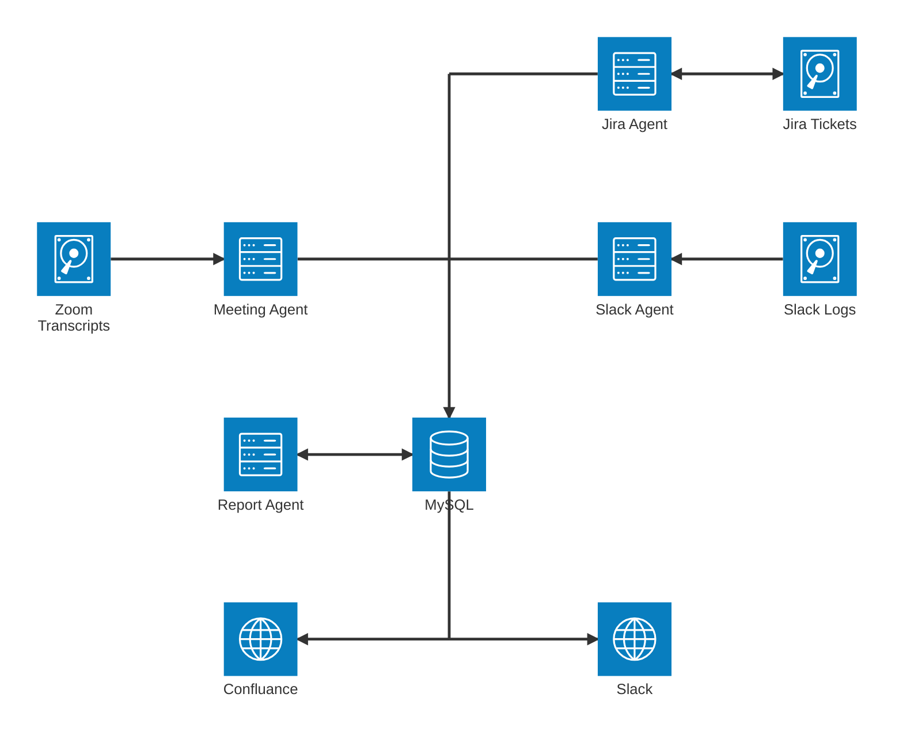

In late 2024, I found myself at an inflection point. I was managing a growing portfolio of technical programs; Each project with its own moving parts, stakeholders, and sources of truth. My weeks were filled with Zoom meetings, Jira ticket reviews, Slack updates, and status report writing. Despite years of experience, I realized that the coordination tax was growing and becoming unsustainable.

I didn’t need another dashboard. I needed something smarter, something that could help me process unstructured data, surface risks, and generate insights fast enough to stay ahead of execution demands.

So I built it.

What started as a simple meeting-note generator quickly evolved into a multi-agent system powered by Claude 3.7 Sonnet. The assistant became a quiet partner in my day-to-day work: analyzing Zoom transcripts, updating Jira tickets, publishing to Confluence, and helping me generate executive ready status reports. Most importantly, it helped me scale. With the assistant in place, I could manage twice the number of programs with greater clarity and less stress.

In this post, I’ll walk through how it works, what I learned, and why I believe agentic systems like this are the future of technical program management.

---

## Implementation Overview

All of these agents were built in **Python**, orchestrated via a **Flask web application**. The Flask UI provided an internal dashboard for uploading transcripts, triggering reports, and reviewing agent output before publication.

## The Foundation: A Central MySQL Database

At the core of the system was a MySQL database that served as structured memory for all ongoing projects. It stored:

- Project metadata  
- Raw Zoom transcripts  
- Meeting notes and participant lists  
- Action items (open and closed)  
- Jira Initiative tickets and their hierarchies  
- Risk entries and flags  
- Slack channel activity  
- Mappings between people and projects  

This database enabled Retrieval-Augmented Generation (RAG) context injection for Claude.

## Simplified Agentic Architecture Overview

---

## The AI Agents in Detail

### Meeting Agent

After every Zoom meeting, the **Meeting Agent** wakes up to process what just happened. It combs through the transcript, looks for actionable threads, and ties those threads back to real projects. It’s like having a virtual note-taker, risk assessor, and Jira whisperer rolled into one.

- **Runs:** After every Zoom meeting  
- **Inputs:** Zoom transcript, open action items, open Jira tickets, open risks, and project data from MySQL  
- **Outputs:**  
  - Project association with a confidence score  
  - Meeting notes (published to Confluence and stored in MySQL)  
  - New action items (pushed to Slack and stored)  
  - Risk update suggestions  
  - Jira ticket comment drafts  
  - Attendance tracking  

### Slack Agent

The **Slack Agent** acts as a silent observer in key project channels. Every hour, it reviews new conversations and checks for signals that might affect action items, tickets, or risks. It’s like having a contextual thread-tracker that connects chatter to actual outcomes.

- **Runs:** Every hour  
- **Inputs:** Slack messages and project-member mappings  
- **Outputs:**  
  - Action item updates  
  - Jira ticket comments with context from discussions  
  - Suggested changes to existing risks  

### Jira Ticket Agent

The **Jira Agent** patrols the evolving structure of initiatives and tasks. It watches for tickets that shift status, become blocked, or introduce risk through complexity. Every hour, it syncs those developments back to the core project record, and flags me via a Slack notification when things look off.

- **Runs:** Every hour  
- **Inputs:** Initiative ticket hierarchies and ticket status deltas  
- **Outputs:**  
  - Suggestions to update open risks  
  - Dependency issue detection  
  - Slack notifications for blockers  
  - Updates to project metadata in MySQL  

### Status Report Agent

The **Status Report Agent** is the storyteller. It assembles program narratives by pulling together data from Jira, meetings, risks, and action items. But unlike the others, it doesn’t speak until you tell it to. It prepares polished, executive-ready reports, then waits for your green light before publishing.

- **Runs:** Weekly or on command  
- **Inputs:** Combined data from Jira, meeting notes, action items, and risks  
- **Outputs:**  
  - A complete, narrative-formatted status report  
  - **Queued for human review before posting**  
  - Once approved, published to Slack and Confluence  

---

## Flattening the Coordination Tax

Before the system was in place, I could confidently manage 6 to 8 programs. With the assistant operational, I was able to scale to 15 parallel programs, each with its own stakeholders, deliverables, and coordination overhead. The system amplified my ability to drive project execution. It also allowed me to scale to more area's of the business and kept the coordination tax flat. With this system in place, the cost of managing two projects effectively became the cost to manage one without the system.

## What I Learned

1. **Long-context reasoning is a game-changer.** Claude 3.7 handled ambiguity and indirect signals better than expected.  
2. **A RAG-backed database is crucial.** Even the best model needs clean, structured memory.  
3. **Agents benefit from focus.** Specializing each agent improved reliability and iteration speed.  
4. **Confidence scoring builds trust.** Outputs were only auto-applied when above a threshold. 
5. **AI doesn't replace TPMs, it scales them.** The real value was how much space it gave me to lead.

## What’s Next

Building this system unlocked a new way of working, but it’s far from finished.

One of my next goals is to extend the assistant’s memory. Right now, each agent processes inputs with some context, but I want to introduce **embedding-based memory** to help Claude recognize long-term program themes, decision history, and team dynamics over time. That kind of continuity would make the outputs even more insightful, and reduce the need to re-seed the same context repeatedly.

I’m also planning to experiment with **Claude’s tool-use APIs**. Right now, data gets piped into the model manually or via scheduled ingestion, but with tool-use, Claude could directly query Jira or Confluence for updates on-demand, closing the loop between reasoning and retrieval.

From a collaboration standpoint, I want to make the system even easier to interact with. One-click **status approval via Slack**, inline with a summary message, would streamline stakeholder feedback. Add a **dashboard UI** for *human-in-the-loop* governance, and the assistant becomes not just a back-end automation tool, but a shared platform for TPMs and engineers alike.

Eventually, I’d like to **open-source a redacted version** of the architecture (stripped of sensitive integrations but rich in best practices). I think other TPMs could benefit from this pattern, whether they’re running two programs or twenty.

The assistant was born from necessity, but it’s grown into something I want to keep evolving for my work, and maybe for the broader program management community in the future.
